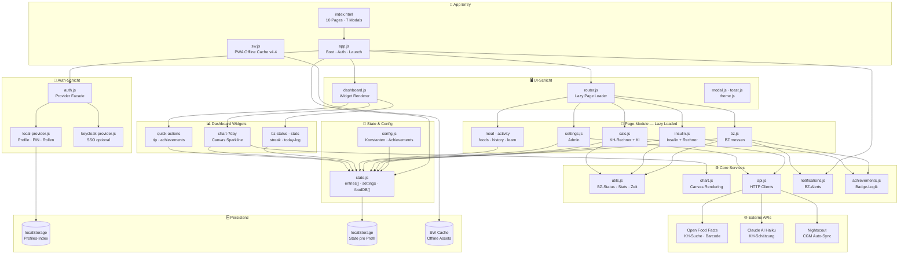

# Zucker-Held v4 — Architektur-Dokumentation

> Letzte Aktualisierung: 2026-04-09

---

## Überblick

Zucker-Held ist eine **Progressive Web App (PWA)** für Diabetes-Management. Die App läuft vollständig im Browser ohne Backend-Server — alle Daten werden lokal im `localStorage` gespeichert.

**Tech-Stack:** Vanilla JavaScript (ES-Module), natives CSS, keine Build-Tools, kein Framework.

---

## Architektur-Diagramm



*Diagramm zum Bearbeiten: https://mermaid.live*

---

## Verzeichnisstruktur

```
/Diabeteshelper/
├── index.html          — Haupt-SPA: alle 10 Seiten als <div id="page-*">
├── app.js              — Entry-Point: Boot, Auth, PIN-Modal, globale Exports
├── styles.css          — Alle Styles (CSS-Variablen, kein Framework)
├── manifest.json       — PWA-Manifest (Icons, Theme-Color)
├── sw.js               — Service Worker: Offline-Cache + Push-Notifications
├── BACKLOG.md          — Produkt-Backlog (priorisiert)
├── ARCHITECTURE.md     — Diese Datei
├── CLAUDE.md           — Projektregeln für Claude Code
│
├── data/
│   └── foods.js        — BUILTIN_FOODS: ~200 Lebensmittel (KH/100g)
│
└── src/
    ├── config.js       — AVATARS, TIPS, ACTIVITIES, ACHIEVEMENTS, STORAGE_KEYS
    ├── state.js        — Zentraler State + save()/load() + Migration v2→v3→v4
    ├── utils.js        — getBZStatus, getBZAdvice, calcKH, formatTime, Stats
    ├── chart.js        — Canvas-basierte BZ-Sparkline und 7-Tage-Chart
    ├── api.js          — Open Food Facts, Claude AI, Nightscout HTTP-Clients
    ├── achievements.js — Badge-Unlock-Logik + UI-Renderer
    ├── notifications.js— Browser-Notification API: BZ-Alerts, Mess-Lücken
    │
    ├── auth/
    │   ├── auth.js         — Provider-Facade (wählt local vs. keycloak)
    │   ├── local-provider.js — Profile, PIN, Rollen, Session, Migration
    │   ├── keycloak-provider.js — SSO (optional, für Praxis-Betrieb)
    │   └── auth-config.js  — Persistierter Auth-Mode (local/keycloak)
    │
    ├── ui/
    │   ├── router.js   — Lazy Page Loader mit Modul-Cache + Back-Stack
    │   ├── dashboard.js— Widget-Renderer + Edit-Mode + Widget-Config
    │   ├── modal.js    — Dialog-System (renderModal, closeModal)
    │   ├── toast.js    — showToast, showSuccess, showError
    │   └── theme.js    — Dark/Light Mode
    │
    ├── modules/        — Lazy-geladene Seiten-Module
    │   ├── bz.js       — BZ-Messung erfassen + Verlauf
    │   ├── insulin.js  — Insulin-Logging + Dosierungs-Rechner (BL-01)
    │   ├── meal.js     — Schnell-Mahlzeit (Name + KH direkt)
    │   ├── calc.js     — KH-Rechner: Food-Suche, Barcode, KI-Schätzung
    │   ├── activity.js — Sport/Aktivitäts-Logger
    │   ├── foods.js    — Lebensmittel-DB verwalten
    │   ├── history.js  — Timeline-Ansicht aller Einträge
    │   ├── learn.js    — Pädagogischer Content (5 Tabs)
    │   └── settings.js — Admin-Panel: Profil, BZ-Ziele, API-Keys, Insulin-Params
    │
    └── widgets/        — Dashboard-Komponenten
        ├── widget-registry.js — WIDGET_REGISTRY mit minRole + defaultEnabled
        ├── bz-status.js       — Letzter BZ + Status-Farbe
        ├── stats.js           — TIR%, Ø-BZ, Streak
        ├── quick-actions.js   — Schnellbuttons für Haupt-Module
        ├── today-log.js       — Heutige Einträge (alle Typen)
        ├── tip.js             — Rotierender Tages-Tipp
        ├── chart-7day.js      — 7-Tage-BZ-Sparkline
        └── achievements.js    — Badge-Übersicht
```

---

## Datenfluss

### Schreiben (User → Storage)
```
User-Eingabe (Modal/Form)
  → Modul-Handler (z.B. bz.js _saveBZ)
  → state.entries.unshift({ type, timestamp, value, ... })
  → state.save() → localStorage.setItem(profileKey, JSON.stringify(state))
  → showSuccess() + checkAndUnlockAchievements() + checkAndNotify()
```

### Lesen (Storage → UI)
```
Boot (app.js DOMContentLoaded)
  → auth.init() → Profil ermitteln
  → setActiveUser(user) → state.load() → localStorage.getItem(profileKey)
  → launchApp(user) → dashboard.renderDashboard()
  → Widgets lesen state.entries[] und rendern HTML
```

### Nightscout Auto-Sync
```
launchApp() abgeschlossen
  → _autoSyncNightscout() (non-blocking, Hintergrund)
  → fetchNightscout(url, token, 288) → 24h CGM-Daten
  → Neue Einträge in state.entries[] einfügen (Duplikat-Check via id)
  → state.save() → checkAndNotify()
```

---

## State-Schema

```javascript
// localStorage-Key: 'zucker-held-v4-{profileId}'
{
  settings: {
    name:                 String,   // Profilname
    avatar:               String,   // Emoji
    min:                  Number,   // BZ-Untergrenze (mg/dL), default: 70
    max:                  Number,   // BZ-Obergrenze (mg/dL), default: 180
    contacts:             Array,    // Notfallkontakte [{name, phone}]
    widgetConfig:         Object,   // { order: [...], disabled: [...] }
    claudeApiKey:         String,   // Anthropic API-Key (optional)
    nightscoutUrl:        String,   // https://ns.beispiel.de
    nightscoutToken:      String,   // Nightscout Access Token
    insulinRatio:         Number,   // 1 IE pro X g KH, default: 10
    correctionFactor:     Number,   // 1 IE senkt BZ um X mg/dL, default: 30
    targetBZ:             Number,   // Ziel-BZ für Korrektur, default: 120
    notificationsEnabled: Boolean,  // Browser-Alerts aktiv
  },
  entries: [
    // BZ-Messung
    { type: 'bz', timestamp, value, measureTime, note, level, inTarget, source? },
    // Mahlzeit
    { type: 'meal', timestamp, name, kh, mealTime, items?: [{name, amount, kh}] },
    // Insulin
    { type: 'insulin', timestamp, units, insulinType, note },
    // Aktivität
    { type: 'activity', timestamp, activity, duration, intensity, kh? },
  ],
  foodDB:               Array,   // Benutzerdefinierte + Online-Lebensmittel
  recentFoodIds:        Array,   // Max 8 zuletzt genutzte IDs
  unlockedAchievements: Array,   // Achievement-IDs
  learnVisits:          Number,
}
```

---

## Rollen-System

```
ROLE_LEVEL = {
  observer:  0,  // 👁️  Nur lesen (Arzt, Familie)
  caregiver: 1,  // 🏫  Einträge erstellen + lesen
  patient:   2,  // 🙋  Vollzugriff auf eigene Daten
  admin:     3,  // 👪  Admin/Eltern (PIN-geschützt)
}
```

**Login-Logik:**
- Profil mit PIN + kein PIN eingegeben → Rolle `patient`
- Profil mit PIN + korrekter PIN → Rolle `admin`
- Profil ohne PIN → Rolle wie in Profil gespeichert

**_elevateToAdmin():** Temporäre Rollenhochstufung für laufende Session (max. bis Reload). Rate-Limit: 3 Versuche → 30s Sperre.

**Widget-Gating:** Widgets haben `minRole` — Observer sieht keine Quick-Actions, Caregiver keine Achievements.

**Settings-Gating:** Sensitive Sektionen (BZ-Zielbereich, Insulin-Params, API-Keys, Daten löschen) sind mit `_adminGate()` geschützt.

---

## Storage-Keys

```
localStorage:
  'zucker-held-v4-profiles'          — Profile-Index (Array aller Profile)
  'zucker-held-v4-{profileId}'       — State pro Profil (entries, settings, ...)
  'zucker-held-v4'                   — Legacy: globaler State (vor Multi-User)
  'zucker-held-v3', 'zucker-held-v2' — Migration-Quellen
  'zh-active-profile-perm'           — Dauerhaft gemerktes aktives Profil

sessionStorage:
  'zh-active-profile'                — Aktives Profil für laufende Session
  'zh-notif-last-{tag}'              — Notification-Cooldown-Timestamps
```

**Migration-Kette:** v2 → v3 → v4 in `state.js load()`. Neue Felder werden mit Defaults befüllt.

---

## Externe Abhängigkeiten

| Service | URL | Zweck | Pflicht? |
|---------|-----|-------|---------|
| Open Food Facts | world.openfoodfacts.org | KH-Suche, Barcode-Lookup | Nein |
| Claude AI | api.anthropic.com | KH-Schätzung aus Text | Nein (API-Key nötig) |
| Nightscout | konfigurierbar | CGM-Daten-Sync | Nein |

**Keine Daten verlassen das Gerät** außer an diese 3 konfigurierten Dienste.

---

## PWA / Offline

- **Service Worker** (`sw.js`): Cache-First für Assets, Network-First für JS-Module
- **Cache-Name:** `zucker-held-v4.4` (bei Breaking-Changes erhöhen!)
- **Offline:** Alle Kernfunktionen (BZ messen, Insulin, Mahlzeit) ohne Internet nutzbar
- **Push-Notifications:** Browser Notification API (lokal, kein Backend nötig)
- **SW → App Messaging:** `postMessage({ type: 'OPEN_PAGE', page: 'bz' })` bei Notification-Click

---

## Neue Features hinzufügen

### Neue Seite
1. `<div id="page-xyz" class="page">` in `index.html`
2. `src/modules/xyz.js` mit `export function render(container)` und `export function init()`
3. In `src/ui/router.js` PAGE_REGISTRY ergänzen
4. Optional: Nav-Button in `<nav class="bottom-nav">`

### Neues Widget
1. `src/widgets/xyz.js` mit `export function render(container, user)`
2. In `src/widgets/widget-registry.js` zum WIDGET_REGISTRY ergänzen (mit `minRole`, `defaultEnabled`)

### Neues localStorage-Feld
1. Default in `state.settings` oder `state.entries` ergänzen
2. In `state.js load()` Migration hinzufügen: `if (!state.settings.newField) state.settings.newField = defaultValue`
3. SW Cache-Name erhöhen: `zucker-held-v4.X`
